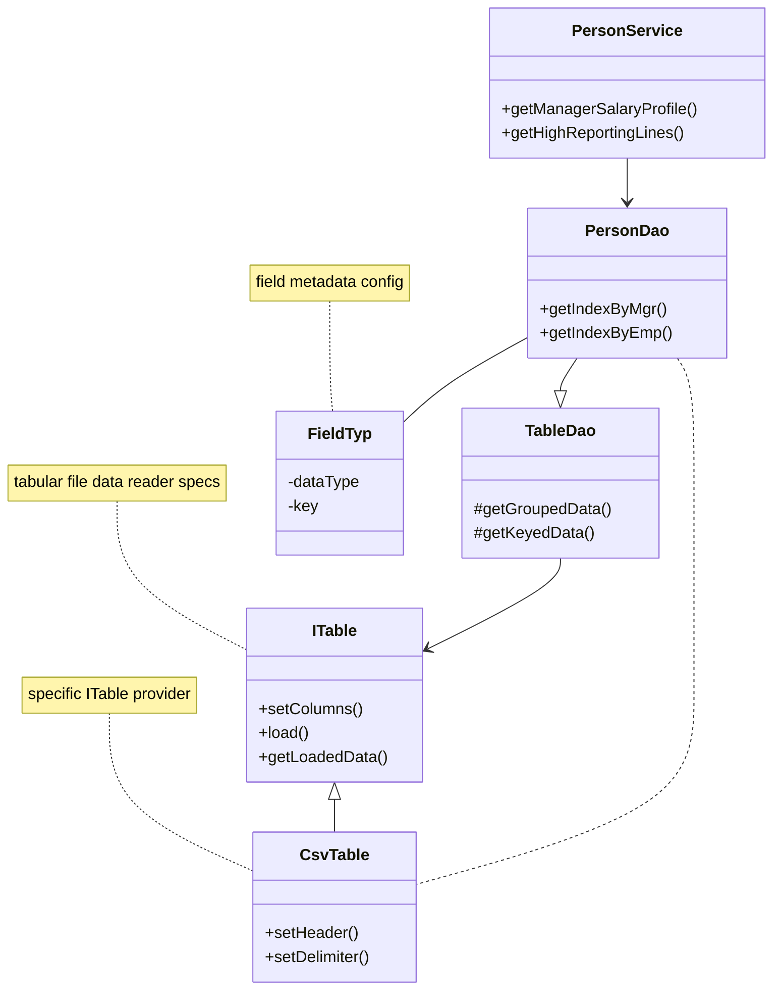

#### Given an employee CSV file with headers, report use cases on employee dimensions. 
Internally the file content is loaded in memory as a collection of key value entries, with keys being the headers. This is the fundamental data structure
on which dimensional data is aggregated as per use case. The data provider (CSV file, in this case) and the data accessor layer is loosely coupled to keep provision for extension.

##### Class Diagram

